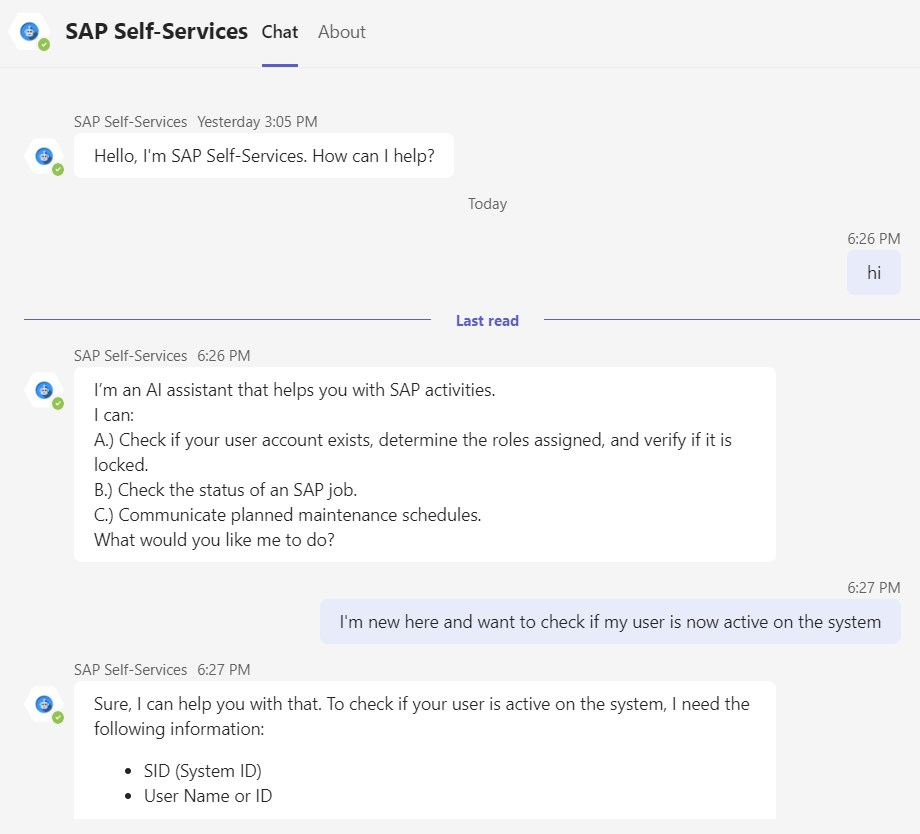
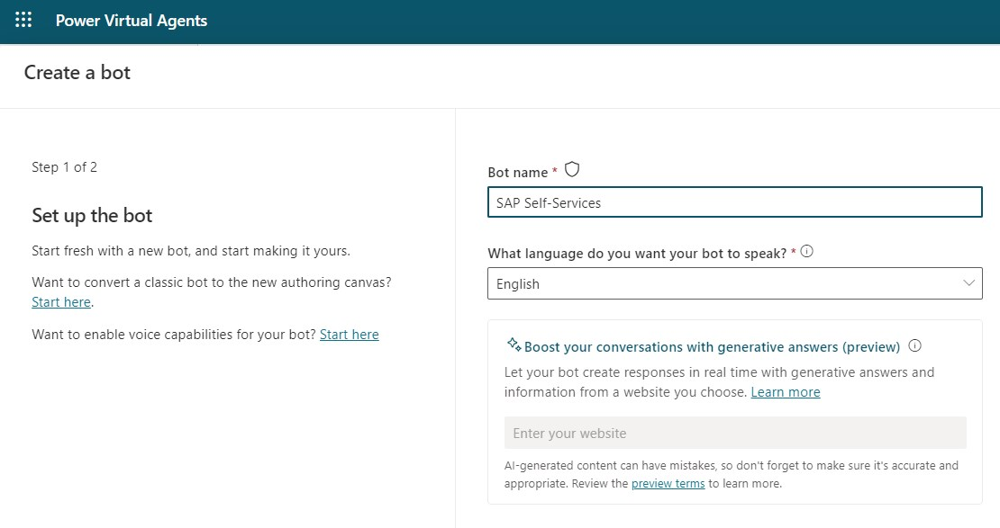
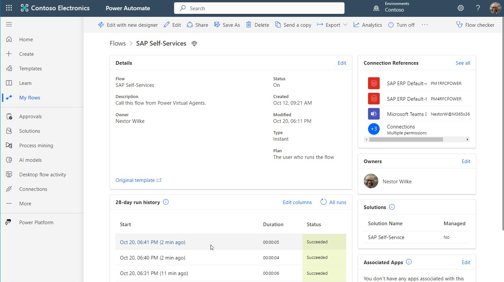
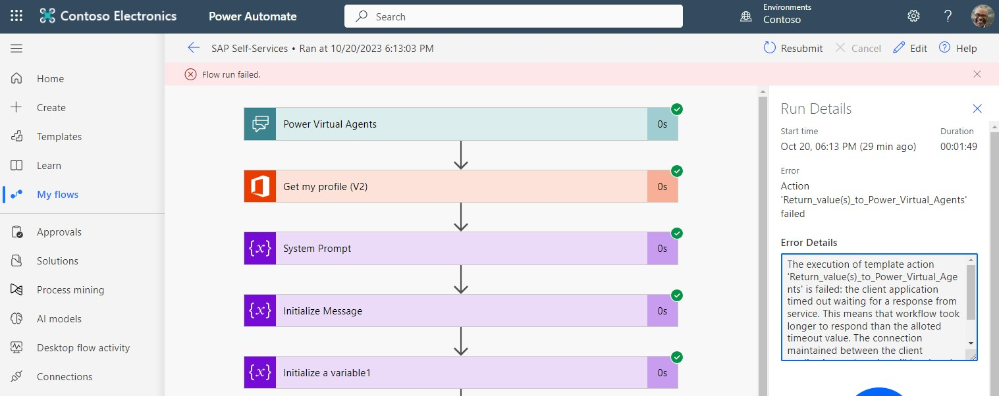

# Azure OpenAI powered SAP Self-Services

Azure OpenAI-powered chatbot for SAP users, enabling account verification, job status checks, as well as providing maintenance schedule communications.

Unlike traditional bots, where users are constrained to rigid, predefined pathways, this AI assistant provides the flexibility to interact in natural language. It mimics a conversational experience like interacting with a human, making it intuitive and user-friendly. Users can freely express their queries and commands in everyday language, eliminating the need to understand complex code or specific command language.

No more clicking through endless menus or decoding tech jargon. Just type what you need, like checking if your account is locked, finding out the status of a job, or schedule a system maintenance. Just write in plain English in your natural language. It’s as easy as chatting with a friend - quick, straightforward, and no hassle!

**Architecture**

**Greetings in Teams**

## Prerequesites

1. Power Platform 
    - Power Virtual Agent (PVA), to create the bot https://web.powerva.microsoft.com/
    - Power Automate Flows: https://make.powerautomate.com/
    - Recommended for productive use is separated DEV and PROD environments
    - Trial license: https://learn.microsoft.com/en-us/power-apps/maker/signup-for-powerapps
1. Azure Subscription
    - Azure Trial: https://azure.microsoft.com/en-us/free
1. Azure OpenAI Service 
    - Deployment Guide: https://learn.microsoft.com/en-us/azure/ai-services/openai/how-to/create-resource?pivots=web-portal
    - Request Access to OpenAI as described. Request only Text & code models.
1. On-Premises Data Gateway
    - Deploement Guide: https://learn.microsoft.com/en-us/power-automate/gateway-reference   
1. SAP System
    - Preferable you can use an existing system
    - Alternatively you can setup a system quite quickly with the Azure Center for SAP Solutions: https://learn.microsoft.com/en-us/azure/sap/center-sap-solutions/overview

# Setup

## Azure OpenAI Service 

- Follow this documentation: https://learn.microsoft.com/en-us/azure/ai-services/openai/how-to/create-resource?pivots=web-portal   
- Once the OpenAI Service is deployed go to Models and deploy the gpt-35-turbo model.  
- Retrieve your endpoint URL and Key in "Chat Playground" -> "View code".

## On-Premises Data Gateway

- Deploy a Windows VM in a subnet that has access to the SAP systems
    - https://learn.microsoft.com/en-us/azure/virtual-machines/windows/quick-create-portal 
- Install the Data Gateway on that VM 
    - https://learn.microsoft.com/en-us/power-automate/gateway-reference

## Setup the Power Automate Flow (Flow)

- Login to: https://make.powerautomate.com/ 
- Go to Solutions and import the Power Automate Flow. 
- Here you can download the flow as zip file: [Download the Power Automate Flow](https://github.com/mimergel/Azure_OpenAI_powered_SAP-Self-Services/raw/main/flow/SAPSelfService_1_0_0_5.zip)

      

## Adapt the HTTP Connector in the Flow

- Get your Azure OpenAI URL and API-Key from the Azure Open AI Service Chat playground.

      

- URI example: https://[your endpoint].openai.azure.com/openai/deployments/[deployed model name]]/chat/completions?api-version=2023-07-01-preview

- Edit the Flow
- Enter the URI and KEY in the respective fields of the HTTP Connector.  

      

- For now you can enter this directly in clear text. For later production use it's recommended to configure these as secrets and put references to the secrets like seen in the screen shot.  

## Adapt SAP ERP and M365 Connectors in the Flow

- In the designer overview you'll see the connections showing errors. These require an update so that it will work in your environment
- Change the connection references in below steps or delete those not required (e.g. Sharepoint list entry). This is needed because the flow was imported from another environment.

    - Get my profile (V2)
    - Call SAP function (V2) (For case A, B & C)
    - Send an email (V2)
    - Post card in chat or channel
    - Create item in Sharepoint list (or delete this step if not needed)

      

- Change all 3 SAP ERP Connectors
- Update the JSON connection definition in "SAP System" field to match your SAP system(s). I'll explain separately how you can change the flow to connect to multiple SAP systems. 

      

-   Also update the connection to your Data Gateway in the "Change connection reference" link

      

- Now you can finally save the flow
- And turn on the flow

## Setup the Power Virtual Agent (PVA)

- Login to: https://web.powerva.microsoft.com/ and create a new bot.  

      

      
     

- In the fallback topic paste the code from the provided fallback.yaml file.  
- Download the fallback topic code here: [fallback.yaml](pva/fallback.yaml)  
- Open the fallback topic in your bot   

      

- Open the code editor and enter the code via copy/paste.   

      

- The last step is to configure your personal bot greeting message into the following 2 topics: 
    - Greetings
    - Reset Conversation  

    Example: 
    > I’m an AI assistant that helps you with SAP activities.
    >
    > I can:
    >
    > A.) Check if your user account exists, determine the roles assigned, and verify if it is locked.
    >
    > B.) Check the status of an SAP job.
    >
    > C.) Communicate planned maintenance schedules.
    >
    > What would you like me to do?

## Test & Publish the Bot

- Test the Bot:

    

    

- When OK publish the bot:

    

- Activate and Open the Bot in Teams

      

- Open the Bot in Teams and test:  

      

## Troubleshooting

- In case of errors most likely the flow failed.    
    - Check here: https://make.powerautomate.com/ in  
        - "My Flows"    
        - "28-days run history"   
- The logs of the flow run provide helpful error messages.   

      

- Example with a timeout error: 

      