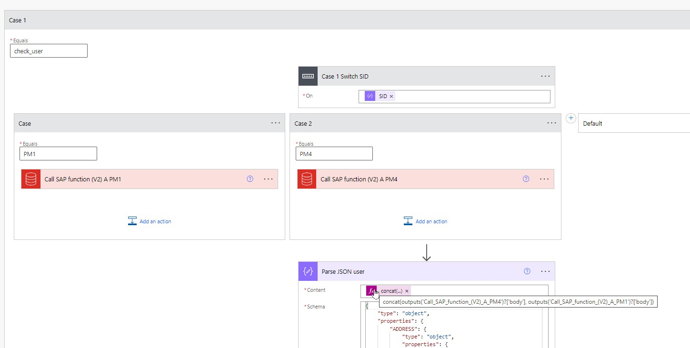

# Extend the functionality to mutliple SAP Systems

To use mutliple SIDs we need to add another switch section into each use-case. Here we see the setup for the check_user case: 



The switch must be done on an expression:

```
body('Parse_JSON_-_identified_action')['SID']
```

Each SAP System requires an own connector. Unfortunatly we cannot enter the SAP connection reference as variable. 

After the SAP connection was made the result must be concatenated in the step `Parse JSON user` to bring the processing back into a single path. The expression for this is: 

```
concat(outputs('Call_SAP_function_(V2)_A_PM1')?['body'], outputs('Call_SAP_function_(V2)_A_PM4')?['body'])
```

Extend and adapt this expression to your SAP SIDs.
